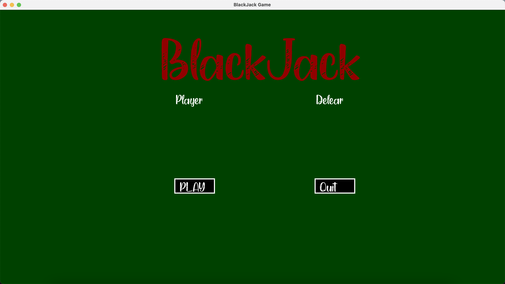
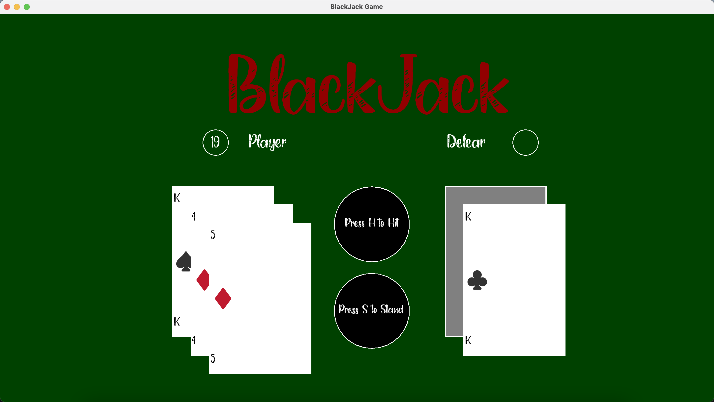
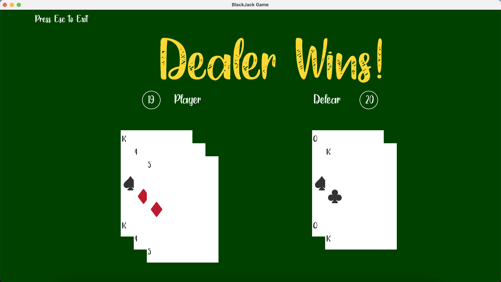

# Blackjack Game
Contributors: [Yue Sun](https://github.com/Sonia-96), [Sree Sai Ogeti ](https://github.com/sreesaiogetiammini)

## Introduction

### Intro Screen

The user clicks `PLAY` to play or `Quit`  to quit the game.



### Game Screen

The user presses `H` to hit the card or `S` to stand. The score will update automatically. If the user chooses to stand, the dealer will reveal their hand. The dealer must keep hitting until their score is equal or higher than 17. Everytime a card is dealed, the sound of dealing a card will play.



### Result Screen

If the player busts or the player's score is less than the dealer's, Dealer Wins. If the dealer busts or the dealer's score is less, the player wins. If their scores are equal, game draws.



## Implementation

- language: C++
- library: [SFML](https://www.sfml-dev.org)
- tools: CMake

## Run it locally

1. Clone this repository to your computer:

   ```bash
   git clone https://github.com/sreesaiogetiammini/FinalProjectCS6010
   cd FinalProjectCS6010
   ```

2. compile the program with CMake:

   ```bash
   mkdir build
   cd build
   cmake ..
   make
   ```

3. run the program in your terminal

   `./blackjack`

## Credits

This game is our final project for the course CS6010 at [MSD](https://msd.utah.edu) program. Thanks [Varun Shanker](https://www.cs.utah.edu/~shankar/) for designing such a comprehensive course with many well-designed assignments and labs. 

## Story behind ...

Yue: Do you have any idea for the final project?

Sai: Car race.

Yue (misheared car as card): Card game? Cool! Then we can use our code for Poker assignment! 

Sai: Sounds great. Let's do it!

Yes, this project starts from a mistake. 😆
